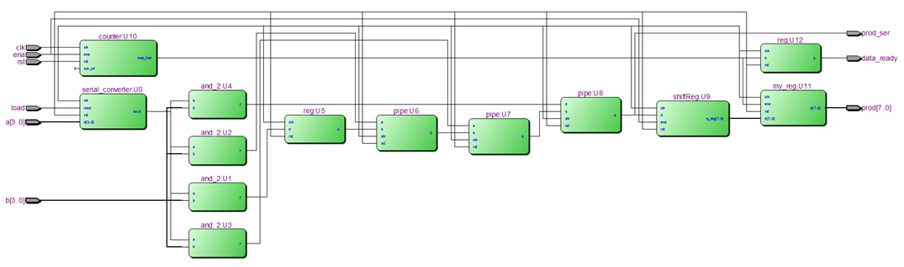
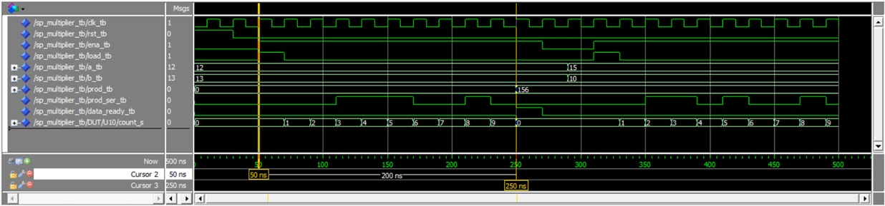

# VHDL Series: Serial-Paraller Multiplier 
4-bit serial-parallel multiplier in VHDL

Date: 2020-04-08

Author: Eduardo Gerlein

Version: 1.0 

Description:
This repository contains all of the code in VHDL to construct a  4-BIT Serial-Parallel multiplier, tested in Modelsim.
 
> Top entity: sp_multiplier.vhd
> 

> Testbench: sp_multiplier_tb.vhd (tested in modelsim)
> 
